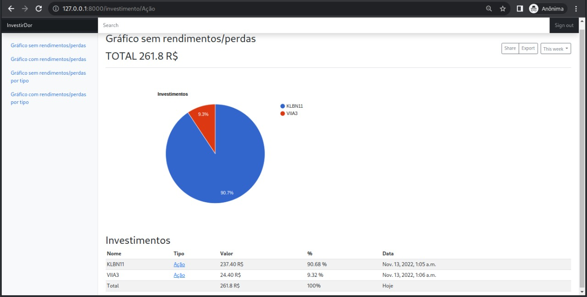

# InvestiDor: um aplicativo para controle financeiro para investimentos

Criei essa aplicação com o objetivo de entender mais sobre o mercado financeiro e sobre investimentos

## Telas

### Carteira investida
Essa primeira tela, mostra onde você investiu seu patrimonio de forma mais descritiva, pelo nome do investimento e a 
quantidade do seu investimento


### Carteira tipo de investimento
Essa tela, mostra onde você investiu através do tipo de investimento (Renda fixa ou renda variavel)


### Carteira filtrada
Essa tela, mostra dentro de um tipo de investimento quais foram os ativos que você investiu (Nesse print
vemos todos os investimentos na área de renda váriavel do usuário, onde temos duas ações diferentes)


### Primeiro acesso para ambiente linux

```
git clone https://github.com/LUCASRENAA/InvestiDor.git
cd InvestiDor
echo "export SECRET_KEY='$(openssl rand -hex 40)'" > .DJANGO_SECRET_KEY
source .DJANGO_SECRET_KEY
sudo apt-get install libpq-dev python3-dev
sudo pip install psycopg2
pip3 install -r requirements.txt 
python3 manage.py migrate
python3 manage.py createsuperuser 
python3 manage.py runserver
```